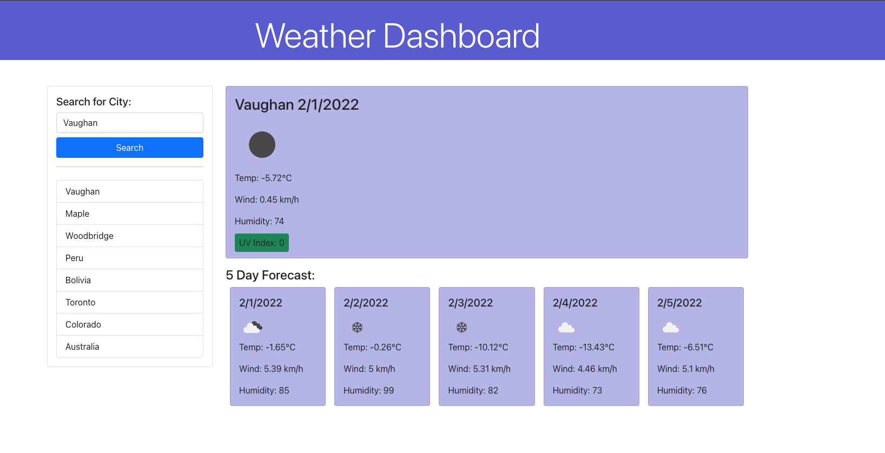

# Weather-Dashboard

## Requirments
Use the [OpenWeather One Call API](https://openweathermap.org/api/one-call-api) to retrieve weather data for cities. You will use `localStorage` to store any persistent data.

## User Story

```
AS A traveler
I WANT to see the weather outlook for multiple cities
SO THAT I can plan a trip accordingly
```

## Acceptance Criteria

```md
GIVEN a weather dashboard with form inputs
WHEN I search for a city
THEN I am presented with current and future conditions for that city and that city is added to the search history
WHEN I view current weather conditions for that city
THEN I am presented with the city name, the date, an icon representation of weather conditions, the temperature, the humidity, the wind speed, and the UV index
WHEN I view the UV index
THEN I am presented with a color that indicates whether the conditions are favorable, moderate, or severe
WHEN I view future weather conditions for that city
THEN I am presented with a 5-day forecast that displays the date, an icon representation of weather conditions, the temperature, the wind speed, and the humidity
WHEN I click on a city in the search history
THEN I am again presented with current and future conditions for that city
```

## Implementation

I first started by creating the `index.html` layout so that I had an overall idea of where my information would go.

I then began by testing the `api` call using the `fetch` method. I printed out what was returned from the call to console and began
reading and understanding the data. I also read through openweather's documentation and quickly saw that I can specify my unit
of measurement and what I want from the api. I then created variables that refrence my elements in my `html` and began 
using the information passed back from the api to populate these elements.

> #### Resources used
>
> - Html
> - JavaScript
> - JQuery
> - CSS

### Sample of api call that sends back longitude and laditude of a given city
```js
let convertCityUrl = "http://api.openweathermap.org/geo/1.0/direct?q=" +searchTextEl.val()+ "&limit=5&appid={api token}";
    fetch(convertCityUrl)
    .then(function (response) 
    {
        urlCheck = response.status;
        return response.json();
    })
    .then(function (data) 
    {
        // Saving the city name in local storage through function
        console.log(data);
        cityName = data[0].name;
        cityInfoList.push(cityName); 
        saveInLocalStorage(data[0].name);
```



### You can view the deployed application via [Weather Dashboard](https://nkrilis.github.io/Weather-Dashboard/) 
### You can also view my javascript here [script.js](./assets/scripts/script.js)
### Thank you for reading me :smiley:
